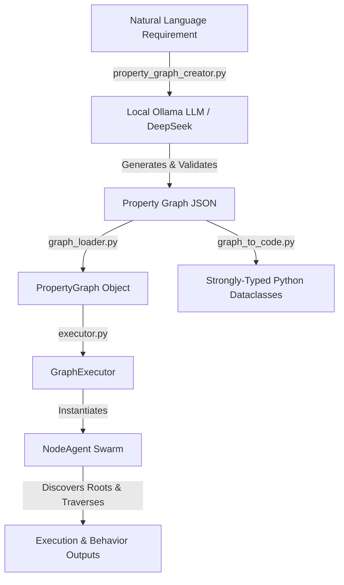

# PropertyGraphSwarm 🕸️🤖

A lightweight, local-first Python framework for generating, parsing, executing, and compiling **agentic property graphs**. 

**PropertyGraphSwarm** bridges natural language requirements and multi-agent execution graphs. It uses local LLMs (via Ollama and DeepSeek) to convert plain-English project descriptions into structured JSON property graphs. It then wraps graph nodes in custom behavior-driven agents (`NodeAgent`) or compiles property graphs directly into strongly-typed, object-oriented Python dataclasses.

---

## 🌟 Key Features

- 🧠 **Local LLM Graph Generation**: Turns natural language prompts into validated JSON property graphs using local models (e.g., DeepSeek via Ollama) with zero cloud dependencies or API keys.
- 🛠️ **Robust Self-Correction**: Includes automatic schema validation and auto-repair prompting if LLM output fails initial parsing.
- ⚡ **Ollama Lifecycle Management**: Automatically checks, selects from installed models, and can autostart `ollama serve` on demand.
- 🎭 **Agentic Node Behaviors**: Node-level behavioral abstraction layer using polymorphic `NodeAgent` classes registered via decorators (`@register_agent`).
- 🐍 **Graph-to-Code Compilation**: Compiles JSON property graphs into strongly-typed Python dataclasses with explicit, relation-based edge methods (`contains()`, `creates()`, `requires()`).
- 🚀 **Graph Orchestration & Traversal**: `GraphExecutor` automatically discovers entry points (root nodes) and drives execution order through direct interactions and relation handling (`handle_relation`).
- 📦 **Zero External Python Dependencies**: Built entirely with standard library Python (`dataclasses`, `urllib`, `json`, `argparse`, etc.).

---

## 🏗️ Architecture & Workflow



### Execution Flow:
1. **Creation**: `property_graph_creator.py` prompts a local LLM to generate a JSON representation of nodes (entities) and directed edges (relations).
2. **Loading & Compilation**:
   - `graph_loader.py` builds an in-memory `PropertyGraph` object indexed for $O(1)$ edge lookups and topological root detection.
   - Graphs can also be compiled into native, object-oriented Python code using dataclasses and typed edge methods.
3. **Instantiation**: `executor.py` maps each graph node to a specific `NodeAgent` subclass using `agents.py`.
4. **Execution**: The executor walks the graph starting from root nodes, running `act()` for each node and `handle_relation()` across outgoing edges.

---

## 📂 Repository Structure

| File | Description |
| :--- | :--- |
| [`property_graph_creator.py`](file:///C:/Users/saket/.gemini/antigravity/scratch/PropertyGraphSwarm/property_graph_creator.py) | Converts English prompts to structured JSON property graphs using local Ollama LLMs. Includes self-healing JSON repair. |
| [`graph_loader.py`](file:///C:/Users/saket/.gemini/antigravity/scratch/PropertyGraphSwarm/graph_loader.py) | Data models (`Node`, `Edge`, `PropertyGraph`) and fast JSON parser with adjacency indexing. |
| [`agents.py`](file:///C:/Users/saket/.gemini/antigravity/scratch/PropertyGraphSwarm/agents.py) | Behavior layer defining base `NodeAgent`, registry decorator `@register_agent`, and concrete node behaviors. |
| [`executor.py`](file:///C:/Users/saket/.gemini/antigravity/scratch/PropertyGraphSwarm/executor.py) | Traversal engine (`GraphExecutor`) that instantiates node agents and executes the graph. |

---

## 📋 Prerequisites

- **Python**: Version 3.8+ (No standard third-party libraries required).
- **Ollama** (for graph generation): Installed and running locally.
  - Download from [ollama.ai](https://ollama.ai/)
  - Pull a code model (e.g., DeepSeek):
    ```bash
    ollama pull deepseek-coder:6.7b
    ```

---

## 🚀 Quick Start

### 1. Generate a Property Graph from Prompt

Run interactive mode or pass a requirement directly:

```bash
# One-shot command
python property_graph_creator.py "Make a funny Bollywood-style scooter video, 30 seconds"

# Automatically start Ollama background process if offline
python property_graph_creator.py --autostart "Build a 2-story modern house project with architect and contractor"

# Interactive prompt mode
python property_graph_creator.py
```

**CLI Flags:**
- `--model <name>` : Specify an Ollama model tag.
- `--host <url>` : Ollama server host (default: `http://localhost:11434`).
- `--out <dir>` : Output directory for JSON graphs (default: `./graphs`).
- `--autostart` : Automatically launch `ollama serve` if not reachable.
- `--list-models` : Print all locally installed Ollama models.

---

### 2. Execute a Property Graph

Run the graph executor on any generated JSON graph:

```bash
python executor.py path/to/property_graph.json
```

**Sample Output:**
```text
=== Executing graph: Architectural blueprints for houses ===

[Project] 'Architectural blueprints for houses' — kicking off (project_house)
    project_house plans to include room: room_living
    project_house plans to include room: room_kitchen
    project_house plans to include room: room_bedroom
[Room] room_living: designing space for 'living area'
[Room] room_kitchen: designing space for 'kitchen'
[Room] room_bedroom: designing space for 'bedroom'
[Actor] agent_architect: acting as architect
    agent_architect (architect) creates project_house
[Actor] agent_contractor: acting as contractor
    agent_contractor (contractor) requires material_wooden
    agent_contractor (contractor) requires material_steel
[Material] material_wooden: sourcing 'wood'
[Material] material_steel: sourcing 'steel'

=== Done. Visit order: ['project_house', 'room_living', 'room_kitchen', 'room_bedroom', 'agent_architect', 'agent_contractor', 'material_wooden', 'material_steel'] ===
```

---

## 📖 Detailed Example: Architectural House Blueprint

This end-to-end example demonstrates how a **House Blueprint requirement** is represented as a structured JSON graph (`property_graph_1785409993.json`) and compiled into executable, strongly-typed Python code.

### 1. Source JSON Property Graph

The JSON graph describes the domain entities (`Project`, `Room`, `Agent`, `Material`) and their directed relationships (`contains`, `creates`, `requires`).

```json
{
  "meta": {
    "goal": "Architectural blueprints for houses",
    "style": "Multi-agent system",
    "duration_sec": null
  },
  "nodes": [
    {
      "id": "project_house",
      "type": "Project",
      "properties": {}
    },
    {
      "id": "room_living",
      "type": "Room",
      "properties": {
        "function": "living area"
      }
    },
    {
      "id": "room_kitchen",
      "type": "Room",
      "properties": {
        "function": "kitchen"
      }
    },
    {
      "id": "room_bedroom",
      "type": "Room",
      "properties": {
        "function": "bedroom"
      }
    },
    {
      "id": "agent_architect",
      "type": "Agent",
      "properties": {
        "role": "architect"
      }
    },
    {
      "id": "agent_contractor",
      "type": "Agent",
      "properties": {
        "role": "contractor"
      }
    },
    {
      "id": "material_wooden",
      "type": "Material",
      "properties": {
        "type": "wood"
      }
    },
    {
      "id": "material_steel",
      "type": "Material",
      "properties": {
        "type": "steel"
      }
    }
  ],
  "edges": [
    {
      "source": "project_house",
      "target": "room_living",
      "relation": "contains",
      "properties": {}
    },
    {
      "source": "project_house",
      "target": "room_kitchen",
      "relation": "contains",
      "properties": {}
    },
    {
      "source": "project_house",
      "target": "room_bedroom",
      "relation": "contains",
      "properties": {}
    },
    {
      "source": "agent_architect",
      "target": "project_house",
      "relation": "creates",
      "properties": {}
    },
    {
      "source": "agent_contractor",
      "target": "material_wooden",
      "relation": "requires",
      "properties": {}
    },
    {
      "source": "agent_contractor",
      "target": "material_steel",
      "relation": "requires",
      "properties": {}
    }
  ]
}
```

---

### 2. Compiled Object-Oriented Python Code

The JSON property graph is compiled into native Python using `@dataclass` structures. Node types (`Project`, `Room`, `Agent`, `Material`) inherit from `GraphNode`, and directed edges become strongly-typed method calls (`contains()`, `creates()`, `requires()`):

```python
"""
Auto-generated by graph_to_code.py — do not edit by hand.
Source graph: property_graph_1785409993.json
"""
from dataclasses import dataclass
from typing import Any, Dict, List, Optional
from collections import defaultdict


@dataclass
class GraphNode:
    """Base class: every generated node type inherits edge storage from this."""
    id: str

    def __post_init__(self):
        self._edges: Dict[str, List['GraphNode']] = defaultdict(list)

    def link(self, relation: str, target: 'GraphNode') -> None:
        """Low-level: record an outgoing edge of the given relation to target."""
        self._edges[relation].append(target)

    def related(self, relation: str) -> List['GraphNode']:
        """All nodes linked from this node via the given relation."""
        return self._edges.get(relation, [])


@dataclass
class Agent(GraphNode):
    role: Optional[str] = None

    def creates(self, target: 'GraphNode') -> None:
        """Edge: Agent --creates--> target."""
        self.link("creates", target)

    def requires(self, target: 'GraphNode') -> None:
        """Edge: Agent --requires--> target."""
        self.link("requires", target)


@dataclass
class Material(GraphNode):
    type: Optional[str] = None


@dataclass
class Project(GraphNode):
    """No properties observed on this node type."""

    def contains(self, target: 'GraphNode') -> None:
        """Edge: Project --contains--> target."""
        self.link("contains", target)


@dataclass
class Room(GraphNode):
    function: Optional[str] = None


def build_graph() -> Dict[str, GraphNode]:
    """Recreate this specific graph as live Python objects."""
    project_house = Project(id='project_house')
    room_living = Room(id='room_living', function='living area')
    room_kitchen = Room(id='room_kitchen', function='kitchen')
    room_bedroom = Room(id='room_bedroom', function='bedroom')
    agent_architect = Agent(id='agent_architect', role='architect')
    agent_contractor = Agent(id='agent_contractor', role='contractor')
    material_wooden = Material(id='material_wooden', type='wood')
    material_steel = Material(id='material_steel', type='steel')

    project_house.contains(room_living)
    project_house.contains(room_kitchen)
    project_house.contains(room_bedroom)
    agent_architect.creates(project_house)
    agent_contractor.requires(material_wooden)
    agent_contractor.requires(material_steel)

    return {
        'project_house': project_house,
        'room_living': room_living,
        'room_kitchen': room_kitchen,
        'room_bedroom': room_bedroom,
        'agent_architect': agent_architect,
        'agent_contractor': agent_contractor,
        'material_wooden': material_wooden,
        'material_steel': material_steel,
    }


if __name__ == "__main__":
    nodes = build_graph()
    for node_id, node in nodes.items():
        print(node)
        for relation, targets in node._edges.items():
            for t in targets:
                print(f"  --{relation}--> {t.id}")
```

### Key Highlights of the Example Case:
1. **Graph Entity Mapping**:
   - `Project` entity (`project_house`) acts as the top-level container holding multiple `Room` entities (`room_living`, `room_kitchen`, `room_bedroom`) via the `contains` relationship.
2. **Actor & Workflow Mapping**:
   - `Agent` entity (`agent_architect`) drives creation of the project via `creates`.
   - `Agent` entity (`agent_contractor`) specifies resource dependencies on `Material` entities (`material_wooden`, `material_steel`) via `requires`.
3. **Polymorphic Edge Methods**:
   - Instead of dynamic string lookups, edge links are compiled into clean Python methods like `project_house.contains(room_living)` or `agent_architect.creates(project_house)`.

---

## 🎨 Extending Behaviors (`agents.py`)

You can easily define custom behaviors for any node type by subclassing `NodeAgent` and decorating it with `@register_agent`:

```python
from agents import NodeAgent, register_agent
from graph_loader import Edge

@register_agent("Scene")
class SceneAgent(NodeAgent):
    def act(self) -> None:
        duration = self.node.get("duration_sec", 0)
        location = self.node.get("location", "unknown")
        print(f"[Scene] {self.node.id}: Rendering scene at {location} ({duration}s)")

    def handle_relation(self, edge: Edge, target: NodeAgent) -> bool:
        if edge.relation == "follows":
            print(f"    Transitioning: {self.node.id} -> {target.node.id}")
            return True
        return super().handle_relation(edge, target)
```

---

## 📄 Property Graph JSON Schema

Generated JSON property graphs follow this strict schema:

```json
{
  "meta": {
    "goal": "Goal description",
    "style": "Style/Domain tag",
    "duration_sec": null
  },
  "nodes": [
    {
      "id": "unique_node_id",
      "type": "NodeType",
      "properties": {
        "key": "value"
      }
    }
  ],
  "edges": [
    {
      "source": "source_node_id",
      "target": "target_node_id",
      "relation": "relation_name",
      "properties": {}
    }
  ]
}
```

---
