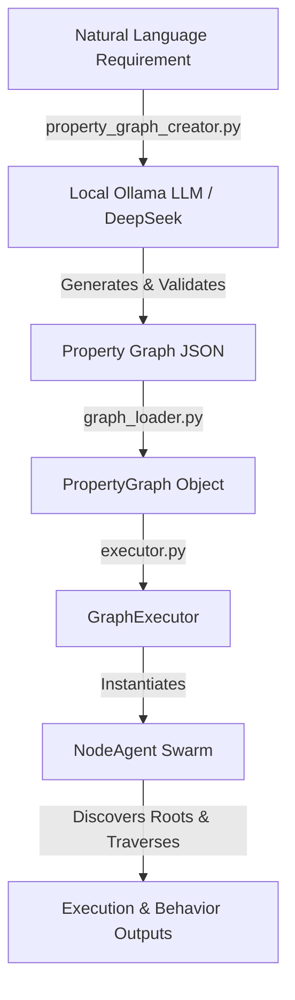

# PropertyGraphSwarm

# PropertyGraphSwarm 🕸️🤖

A lightweight, local-first Python framework for generating, parsing, and executing **agentic property graphs**. 

**PropertyGraphSwarm** bridges natural language requirements and multi-agent execution graphs. It uses local LLMs (via Ollama and DeepSeek) to convert plain-English project descriptions into structured JSON property graphs. It then wraps graph nodes in custom behavior-driven agents (`NodeAgent`) and orchestrates traversal across the graph.

---

## 🌟 Key Features

- 🧠 **Local LLM Graph Generation**: Turns natural language prompts into validated JSON property graphs using local models (e.g., DeepSeek via Ollama) with zero cloud dependencies or API keys.
- 🛠️ **Robust Self-Correction**: Includes automatic schema validation and auto-repair prompting if LLM output fails initial parsing.
- ⚡ **Ollama Lifecycle Management**: Automatically checks, selects from installed models, and can autostart `ollama serve` on demand.
- 🎭 **Agentic Node Behaviors**: Node-level behavioral abstraction layer using polymorphic `NodeAgent` classes registered via decorators (`@register_agent`).
- 🚀 **Graph Orchestration & Traversal**: `GraphExecutor` automatically discovers entry points (root nodes) and drives execution order through direct interactions and relation handling (`handle_relation`).
- 📦 **Zero External Python Dependencies**: Built entirely with standard library Python (`dataclasses`, `urllib`, `json`, `argparse`, etc.).

---

## 🏗️ Architecture & Workflow



### Execution Flow:
1. **Creation**: `property_graph_creator.py` prompts a local LLM to generate a JSON representation of nodes (entities) and directed edges (relations).
2. **Loading**: `graph_loader.py` builds an in-memory `PropertyGraph` object indexed for $O(1)$ edge lookups and topological root detection.
3. **Instantiation**: `executor.py` maps each graph node to a specific `NodeAgent` subclass using `agents.py`.
4. **Execution**: The executor walks the graph starting from root nodes, running `act()` for each node and `handle_relation()` across outgoing edges.

---

## 📂 Repository Structure

| File | Description |
| :--- | :--- |
| [`property_graph_creator.py`](file:///C:/Users/saket/.gemini/antigravity/scratch/PropertyGraphSwarm/property_graph_creator.py) | Converts English prompts to structured JSON property graphs using local Ollama LLMs. Includes self-healing JSON repair. |
| [`graph_loader.py`](file:///C:/Users/saket/.gemini/antigravity/scratch/PropertyGraphSwarm/graph_loader.py) | Data models (`Node`, `Edge`, `PropertyGraph`) and fast JSON parser with adjacency indexing. |
| [`agents.py`](file:///C:/Users/saket/.gemini/antigravity/scratch/PropertyGraphSwarm/agents.py) | Behavior layer defining base `NodeAgent`, registry decorator `@register_agent`, and concrete node behaviors. |
| [`executor.py`](file:///C:/Users/saket/.gemini/antigravity/scratch/PropertyGraphSwarm/executor.py) | Traversal engine (`GraphExecutor`) that instantiates node agents and executes the graph. |

---

## 📋 Prerequisites

- **Python**: Version 3.8+ (No standard third-party libraries required).
- **Ollama** (for graph generation): Installed and running locally.
  - Download from [ollama.ai](https://ollama.ai/)
  - Pull a code model (e.g., DeepSeek):
    ```bash
    ollama pull deepseek-coder:6.7b
    ```

---

## 🚀 Quick Start

### 1. Generate a Property Graph from Prompt

Run interactive mode or pass a requirement directly:

```bash
# One-shot command
python property_graph_creator.py "Make a funny Bollywood-style scooter video, 30 seconds"

# Automatically start Ollama background process if offline
python property_graph_creator.py --autostart "Build a 2-story modern house project with architect and contractor"

# Interactive prompt mode
python property_graph_creator.py
```

**CLI Flags:**
- `--model <name>` : Specify an Ollama model tag.
- `--host <url>` : Ollama server host (default: `http://localhost:11434`).
- `--out <dir>` : Output directory for JSON graphs (default: `./graphs`).
- `--autostart` : Automatically launch `ollama serve` if not reachable.
- `--list-models` : Print all locally installed Ollama models.

---

### 2. Execute a Property Graph

Run the graph executor on any generated JSON graph:

```bash
python executor.py path/to/property_graph.json
```

**Sample Output:**
```text
=== Executing graph: Construction Project ===

[Project] 'Construction Project' — kicking off (proj_1)
    proj_1 plans to include room: room_living
[Room] room_living: designing space for 'relaxation'
[Actor] agent_architect: acting as Lead Architect
    agent_architect (Lead Architect) creates room_living

=== Done. Visit order: ['proj_1', 'room_living', 'agent_architect'] ===
```

---

## 🎨 Extending Behaviors (`agents.py`)

You can easily define custom behaviors for any node type by subclassing `NodeAgent` and decorating it with `@register_agent`:

```python
from agents import NodeAgent, register_agent
from graph_loader import Edge

@register_agent("Scene")
class SceneAgent(NodeAgent):
    def act(self) -> None:
        duration = self.node.get("duration_sec", 0)
        location = self.node.get("location", "unknown")
        print(f"[Scene] {self.node.id}: Rendering scene at {location} ({duration}s)")

    def handle_relation(self, edge: Edge, target: NodeAgent) -> bool:
        if edge.relation == "follows":
            print(f"    Transitioning: {self.node.id} -> {target.node.id}")
            return True
        return super().handle_relation(edge, target)
```

---

## 📄 Property Graph JSON Schema

Generated JSON property graphs follow this strict schema:

```json
{
  "meta": {
    "goal": "Funny travel reel",
    "style": "Bollywood comedy",
    "duration_sec": 30
  },
  "nodes": [
    {
      "id": "scene_1",
      "type": "Scene",
      "properties": {
        "duration_sec": 10,
        "location": "mountain_road"
      }
    },
    {
      "id": "char_traveller",
      "type": "Character",
      "properties": {
        "role": "Lead"
      }
    }
  ],
  "edges": [
    {
      "source": "char_traveller",
      "target": "scene_1",
      "relation": "appears_in",
      "properties": {}
    }
  ]
}
```

---
